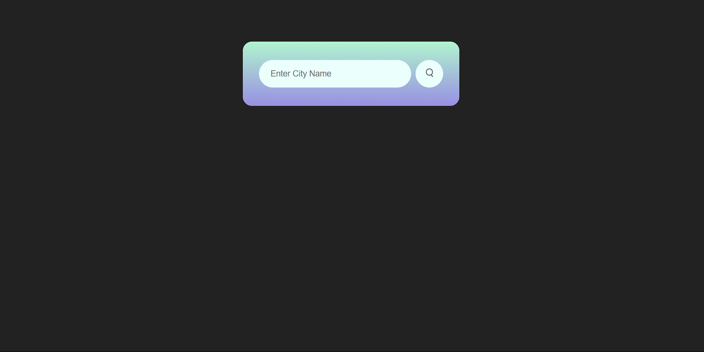
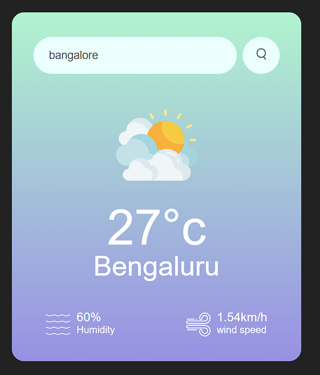
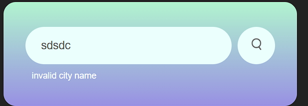

# Weather App ⛅☔❄


A simple and elegant weather app built with HTML, CSS, and JavaScript. This app fetches real-time weather data using the OpenWeatherMap API and displays the current weather conditions for any city.

## Features 👍
- Search for weather by city name.
- Displays:
  - Current temperature.
  - Humidity percentage.
  - Wind speed.
  - Weather condition with a matching icon.
- Error handling for invalid city names.
- Clean and responsive UI.

## Installation Steps 🛠️

- Clone the repository

- Create an account on OpenWeatherMap and generate your API key.

- Open the script section of the index.html file and replace the apiKey value with your generated API key:
 ```javascript
   const apiKey = "your_api_key_here";
   ```


- Open index.html in your favorite browser.

## Usage 🌐

1. Enter a city name in the search bar.
2. Click the search button or press Enter.
3. View the weather details for the entered city.

## Technology Stack 🛠
- HTML5
- CSS3
- JavaScript (ES6+)
- OpenWeatherMap API

## Screenshots 📸

### Main Interface:




### Error Message:


## Future Enhancements 📈
- Add support for multiple units (Celsius, Fahrenheit).
- Display a 7-day weather forecast.
- Implement geolocation to fetch weather for the user’s current location.

## Acknowledgments 🙏
- Weather data provided by [OpenWeatherMap](https://openweathermap.org/).
- Icons from [Freepik](https://www.flaticon.com/).


Feel free to fork and contribute to this project. Happy coding! 🚀

